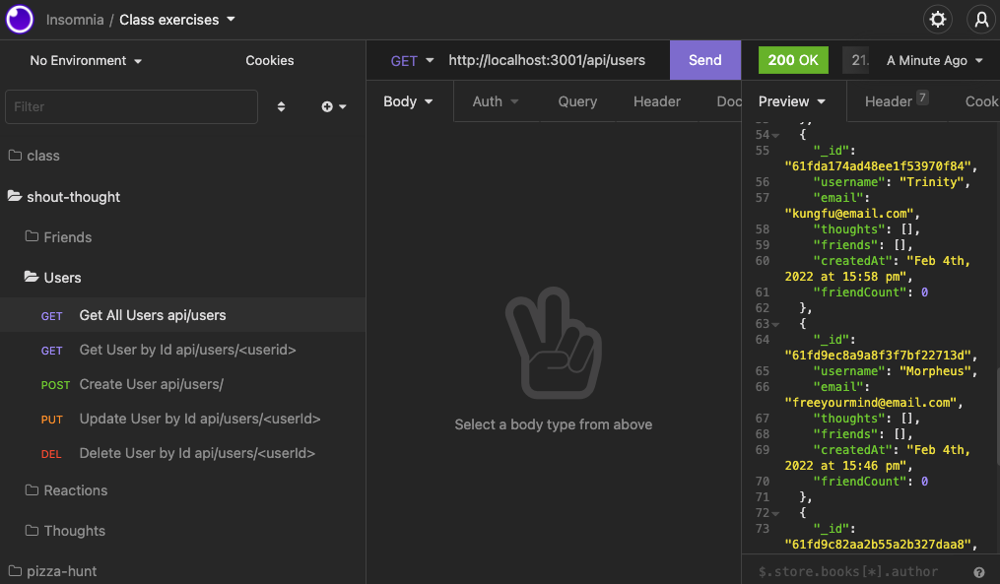

# Shout Thought

Shout your thoughts out to the world with this social media API.

Video Walkthrough: link here

## Table of Contents

- [Installation](#installation)
- [Usage](#usage)
- [License](#license)
- [Contributions](#contributions)
- [Technologies](#technologies)
- [Credits](#credits)
- [Questions](#questions)

## Installation

Clone the project. Run `npm i` in your Command Line Interface. Start your server with `node server`.

## Usage

This is an API for a social network, there is no front end. You must have Insomnia or another API testing tool to use it. You can create a user, who may create a thought, and thoughts can have reactions. Users can also have friends. API endpoints begin with `http://localhost:3001/` and are appended with the following:

- Users:
- GET request: Read all users `api/users`
- GET request: Read a single user by ID `api/users/:userId`
- POST request: Create a user `api/users` expects JSON body: `{ "username":"string", "email":"string" }`
- PUT request: Update a user by ID `api/users/:userId` expects JSON body: `{ "username":"string", "email":"string@string.string" }`
- DELETE request: Delete a user by ID `api/users/:userId`

- Thoughts:
- GET request: Read all thoughts `api/thoughts`
- GET request: Read a single thought by ID `api/thoughts/:thoughtId`
- POST request: Create a thought `api/thoughts` expects JSON body: `{ "thoughtText": "string", "username": "string" }`
- PUT request: Update a thought by ID `api/thoughts/:thoughtId` expects JSON body: `{ "thoughtText": "string", "username": "string" }`
- DELETE request: Delete a thought by ID `api/thoughts/:thoughtId`

- Reactions:
- POST request: Create reaction: `api/thoughts/:thoughtId/reactions` expects JSON body `{ "reactionBody": "string", "username": "string" }`
- DELETE request: Delete reaction: `api/thoughts/:thoughtId/reactions/:reactionId`

- Friends:
- POST request: Add friend `api/users/:userId/friends/:friendId`
- DELETE request: Delete friend `api/users/:userId/friends/:friendId`

## License

This project is licensed under the MIT license.

## Contributions

Fork the project and create a pull request. Let me know how you think you can contribute!

## Technologies

Created with Node.js, Express.js, MongoDB, Mongoose, and Insomnia.

## Credits

Created by Joshua Schermann

## Questions

Post an issue if you find a bug or have a suggested improvement.
